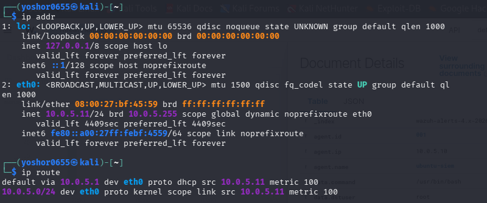
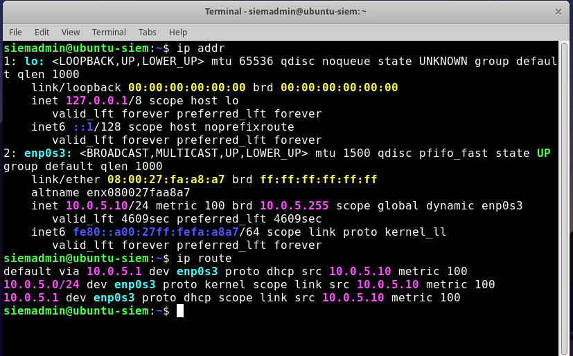
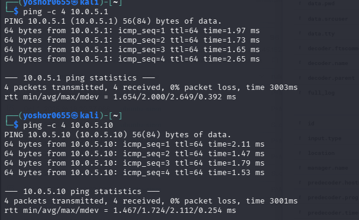
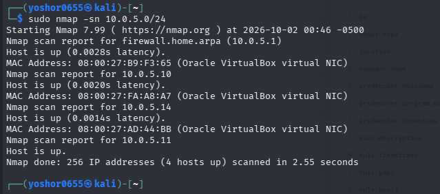
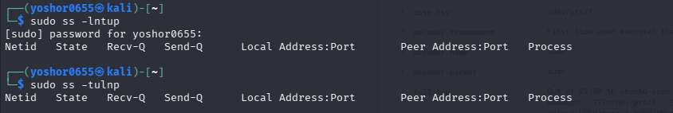

# Phase 2 — Networking & Linux Fundamentals

## Objective

The objective of this phase was to develop a practical understanding of networking and Linux administration inside my cybersecurity home lab.

Instead of only studying networking concepts theoretically, I practiced identifying network interfaces, IP addresses, routes, gateways, ports, services, and communication between systems.

## Lab Network

My SecurityLab network uses:

- **Network:** `10.0.5.0/24`
- **Gateway:** `10.0.5.1` — pfSense
- **Ubuntu-SIEM:** `10.0.5.10`
- **Wazuh Server:** `10.0.5.14`
- **Kali Linux:** `10.0.5.11`

This helped me understand how multiple systems communicate within the same subnet and how pfSense functions as the network gateway.

## Linux Networking

I practiced using Linux commands to inspect and troubleshoot network configuration.

### Kali Linux Network Configuration

I verified the Kali Linux network configuration using `ip addr` and `ip route`.



The Kali workstation received an IP address on the `10.0.5.0/24` SecurityLab network and used pfSense at `10.0.5.1` as its default gateway.

### Ubuntu Network Configuration

I also verified the Ubuntu-SIEM server's IP address and routing configuration.



### IP Address and Interfaces

```bash
ip addr
```

I used `ip addr` to identify network interfaces, IP addresses, interface status, and subnet information.

### Routing

```bash
ip route
```

I used `ip route` to examine the routing table and identify the default gateway.

In my SecurityLab, pfSense at `10.0.5.1` functions as the gateway.

### Connectivity Testing


```bash
ping 10.0.5.1
ping 10.0.5.11
```

I used `ping` to test connectivity between systems and troubleshoot network communication.

## Ports and Services

```bash
ss -lntup
```

I used `ss` to examine TCP and UDP sockets, listening ports, network services, and the processes associated with them.

This helped me understand the relationship between IP addresses, ports, and services.

## Network Reconnaissance with Nmap

From Kali Linux, I practiced using Nmap against systems inside my controlled lab environment.

```bash
nmap 10.0.5.11
```

I used Nmap to identify open ports and available services.

I also practiced service/version detection:

```bash
nmap -sV 10.0.5.11
```

This helped me understand how a security analyst or attacker can identify services exposed by another system.

## SSH

I configured and tested SSH access to my Ubuntu system.

This allowed me to practice:

- Remote authentication
- Client/server communication
- TCP port 22
- Linux user accounts
- Authentication logging

SSH later became an important part of my security monitoring exercises because login attempts generated authentication events that I could investigate.

## Key Concepts Learned

During this phase, I developed a better understanding of:

- IP addressing
- Subnets
- Default gateways
- Routing
- TCP and UDP
- Ports and services
- SSH
- Client/server communication
- Network reconnaissance
- Linux networking commands
- Network troubleshooting

## Connection to Cybersecurity

This phase taught me that before investigating suspicious network activity, I first need to understand what normal communication looks like.

Understanding hosts, IP addresses, routes, ports, protocols, and services created the foundation for the attack simulation, log analysis, detection, and SIEM monitoring performed in later phases.

## 🔎 Network Verification and Host Discovery

After configuring the lab network, I verified connectivity and performed basic network reconnaissance from Kali Linux.

### Kali Network Configuration

Kali Linux received the following configuration through DHCP:

- IP address: `10.0.5.11/24`
- Network: `10.0.5.0/24`
- Default gateway: `10.0.5.1`
- Interface: `eth0`

I used `ip addr` to identify the network interface and IP address and `ip route` to verify the routing table and default gateway.

### Connectivity Testing


I tested communication from Kali Linux to the pfSense gateway:

`ping -c 4 10.0.5.1`

Result: 4 packets transmitted, 4 received, 0% packet loss.

I also tested communication between Kali Linux and Ubuntu-SIEM:

`ping -c 4 10.0.5.10`

Result: 4 packets transmitted, 4 received, 0% packet loss.

This confirmed that the systems could communicate successfully across the isolated `10.0.5.0/24` lab network.

### Host Discovery


I performed host discovery on the lab subnet using:

`sudo nmap -sn 10.0.5.0/24`

The scan identified four active hosts on the lab network, including the pfSense gateway, Ubuntu-SIEM, Kali Linux, and another active virtual system.

### Service Enumeration


I scanned the Ubuntu-SIEM server for exposed TCP services using:

`sudo nmap -sV 10.0.5.10`

The scan identified:

- Port `22/tcp` — OPEN
- Service — SSH
- Software — OpenSSH

This demonstrated how network reconnaissance can be used to identify reachable systems, exposed ports, and running services.

## 🧠 What I Learned

Through this exercise, I practiced:

- Identifying IPv4 addresses and network interfaces
- Reading Linux routing tables
- Understanding the role of a default gateway
- Testing connectivity with ICMP
- Understanding `/24` subnets
- Discovering active hosts with Nmap
- Identifying open ports and services
- Understanding the relationship between networking and security reconnaissance
