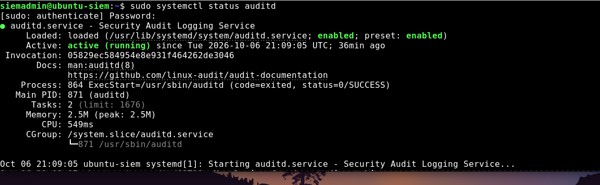
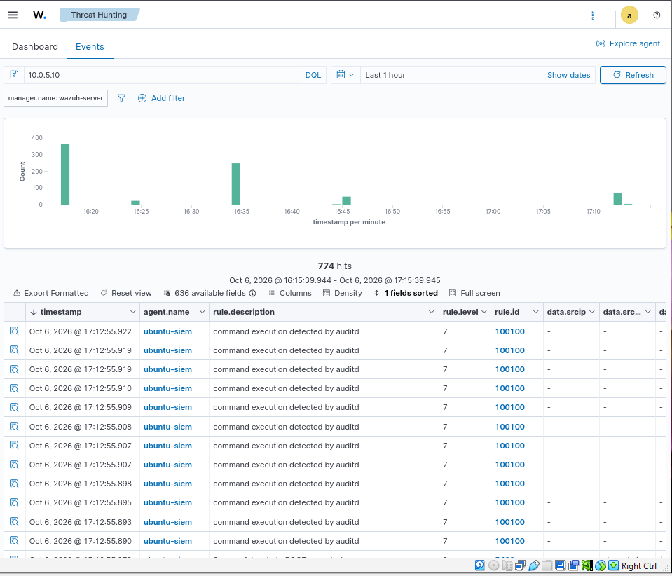
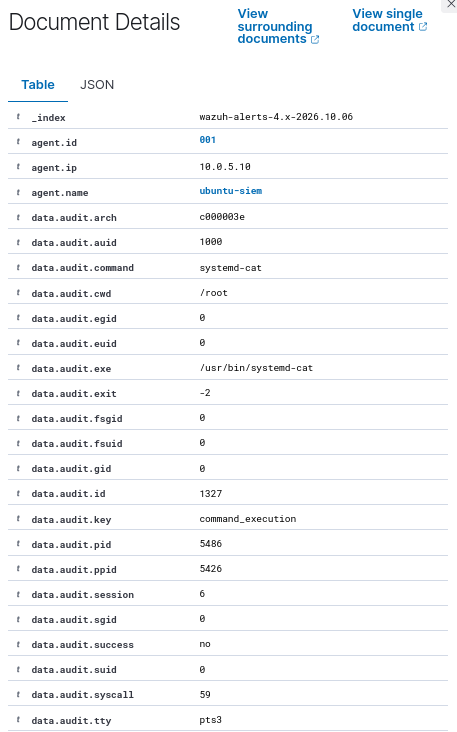
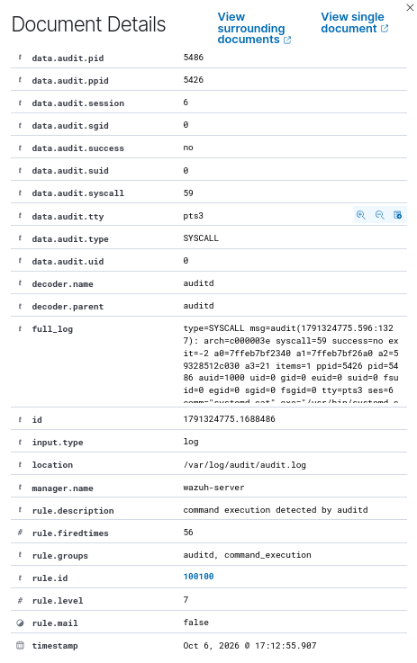

# Phase 4 — Security Monitoring & Auditd

## Objective

The objective of this phase is to move beyond manually reviewing individual
authentication logs and begin monitoring system activity using security
monitoring and Linux auditing tools.

In this phase, I worked with Wazuh and Linux Audit (auditd) on my Ubuntu-SIEM
system to understand how host activity can be collected, monitored, and
investigated.

The goal is to understand not only that an event occurred, but also which user
initiated the activity, what privilege level was used, what executable was
involved, and how the event can be reconstructed during an investigation.

## Lab Environment

- **Kali Linux:** Simulated attacker/testing system
- **Ubuntu-SIEM:** Monitored endpoint
- **Wazuh:** Security monitoring and event analysis
- **auditd:** Linux auditing framework
- **pfSense:** Network gateway/firewall
- **Network:** Isolated cybersecurity home lab

## Linux Audit Configuration

During this phase, I configured and troubleshot Linux Audit on Ubuntu-SIEM.

I verified that the audit service was active and generated activity that could
be investigated through the Linux audit logs.

### Auditd Service Verification

I verified that the `auditd` service was active and running on Ubuntu-SIEM.



The purpose of using auditd was to gain more visibility into system activity
than authentication logs alone can provide.

## Audit Event Investigation

I used `ausearch` on Ubuntu-SIEM to investigate events recorded by Auditd.

One event contained information such as:

```text
exe=/usr/sbin/ausearch
uid=0
auid=1000
key=command_execution
```

### Understanding the Audit Fields

The Auditd event provides several important pieces of information:

- **exe=/usr/sbin/ausearch** — identifies the executable that generated the recorded activity. In this case, the `ausearch` utility was executed.

- **uid=0** — represents the effective user ID associated with the execution. UID `0` corresponds to the `root` account, indicating that the command was executed with root privileges.

- **auid=1000** — represents the Audit User ID. Unlike the effective UID, the AUID tracks the original user who started the login session. This is useful during investigations because it can help identify who initiated an action even after privilege escalation.

- **key=command_execution** — is the custom Auditd rule key used to categorize the event. I configured this key so command execution events could be searched and identified more easily.

Together, these fields show that a command executed with root privileges while Auditd preserved information about the original user associated with the session.


## Wazuh Audit Event Analysis

After investigating the events locally, I used Wazuh to analyze the Auditd events collected from the Ubuntu-SIEM endpoint.

Wazuh converted the raw Linux Audit events into structured security fields, making the activity easier to investigate.

One command execution event showed:

```text
Agent: ubuntu-siem
Agent IP: 10.0.5.10
Executable: /usr/bin/sed
Command: sed
UID: 1000
AUID: 1000
Audit Key: command_execution
Success: yes
Decoder: auditd
```
### Understanding the Wazuh Event

The structured Wazuh event provided additional information about the activity:

- **Agent: ubuntu-siem** — identifies the monitored endpoint that generated the event.

- **Agent IP: 10.0.5.10** — identifies the IP address of the Ubuntu-SIEM endpoint monitored by Wazuh.

- **Executable: /usr/bin/sed** — shows the full path of the program that was executed.

- **Command: sed** — identifies the command that Auditd observed.

- **UID: 1000** — identifies the user ID under which the command executed.

- **AUID: 1000** — identifies the original authenticated user associated with the session.

- **Audit Key: command_execution** — shows that the event matched the Auditd rule I configured to monitor command execution.

- **Success: yes** — indicates that the recorded system call completed successfully.

- **Decoder: auditd** — shows that Wazuh recognized the event as Linux Auditd data and parsed it using its Auditd decoder.

By converting the raw Auditd event into structured fields, Wazuh made it easier to determine what happened, where it happened, which user was involved, and whether the activity was successful.

### Event Interpretation

I analyzed the individual fields generated by Auditd and parsed by Wazuh to understand the activity represented by the alert.

The event showed that `/usr/bin/sed` was executed from the `/home/siemadmin` directory.

Important fields included:

- `command = sed` — identifies the command that was executed.
- `exe = /usr/bin/sed` — identifies the executable associated with the event.
- `cwd = /home/siemadmin` — shows the working directory where the process was executed.
- `auid = 1000` — identifies the original authenticated user associated with the audit session.
- `uid = 1000` — identifies the user ID under which the process was running.
- `euid = 1000` — shows the effective user ID used during execution.
- `success = yes` — indicates that the audited system call completed successfully.
- `tty = pts1` — indicates that the activity was associated with a pseudo-terminal session.
- `key = command_execution` — identifies the Auditd rule key used to categorize the event.

Because the AUID, UID, and EUID were all `1000`, this event did not show the command executing with root privileges.

This exercise demonstrated that a Wazuh alert does not automatically indicate malicious activity. The alert provides evidence that must be interpreted in context by the analyst.



### Root-Level Command Execution Analysis

I also investigated an Auditd event involving a process executing with elevated privileges.

  

Important fields included:

- `auid = 1000` — identifies the original authenticated user associated with the audit session.
- `command = systemd-cat` — identifies the command recorded in the event.
- `exe = /usr/bin/systemd-cat` — identifies the executable that was launched.
- `cwd = /root` — shows that the process was operating from the root user's home directory.
- `euid = 0` — indicates that the process was executing with root privileges.
- `egid = 0` — indicates that the process was operating with the root group.
- `fsuid = 0` — indicates root privileges were being used for filesystem access.
- `fsgid = 0` — indicates the root group was being used for filesystem access.
  

### Analyst Interpretation

This event was different from the previous normal-user command execution.

In the previous event, the AUID, UID, and EUID were all `1000`, indicating that the command was executed with the privileges of the normal user.

In this event, the `AUID` remained `1000`, while the effective user and group IDs changed to `0`.

This indicates that activity originating from the authenticated user session was executing with root-level privileges.

## Event Correlation

After analyzing individual Auditd and Wazuh events, I correlated the activity to reconstruct the sequence of events.

The investigation showed the following progression:

1. The `siemadmin` user authenticated to the Ubuntu-SIEM system.
2. Activity was initially executed under the normal user context (UID 1000).
3. The user used `sudo` to obtain elevated privileges.
4. A root-level session was established.
5. Subsequent processes executed with an effective UID (EUID) of `0`.
6. Auditd recorded the activity and Wazuh collected and analyzed the events.

This demonstrated how multiple security events can be correlated to reconstruct user activity and identify privilege escalation.

Rather than analyzing each alert independently, event correlation provided the context needed to understand the complete sequence of activity:

`User Login → Normal Activity → Privilege Escalation → Root Activity → Auditd → Wazuh Detection`

## Phase 4 Conclusion

This phase helped me move from simply reading Linux logs to understanding how security monitoring tools collect, structure, and correlate system activity.

By combining Linux Auditd with Wazuh, I practiced identifying:

- Command execution
- User and session attribution
- Normal versus elevated execution
- Root-level activity
- Privilege escalation indicators
- Wazuh detection rules and alert severity
- Event correlation across multiple security events

One of the most important lessons from this phase was that an alert does not automatically mean an incident.

The analyst must examine the command, user context, privileges, source, timeline, and surrounding events before determining whether activity is normal or suspicious.

This phase strengthened my understanding of the security monitoring workflow:

`System Activity → Auditd → Log Collection → Wazuh → Detection → Investigation → Event Correlation → Analyst Conclusion`

The event demonstrates why analysts should examine multiple identity fields instead of looking only at the username or command. Linux Audit can preserve information about the original authenticated session while also showing the privileges used by a process.

This information can help an analyst reconstruct activity involving privilege escalation and determine what a user did after obtaining elevated access.
