# Phase 5 – Detection Engineering and Attack Simulation

## Objective

The goal of Phase 5 is to move beyond simply reviewing security logs and begin building a more structured detection process. In this phase, I generated suspicious activity, collected security events, configured monitoring, and prepared the environment for detection and investigation using Wazuh and Auditd.

---

## 1. Verify Auditd Service

I verified that the Auditd service was installed and running on the Ubuntu server before beginning the attack simulation.

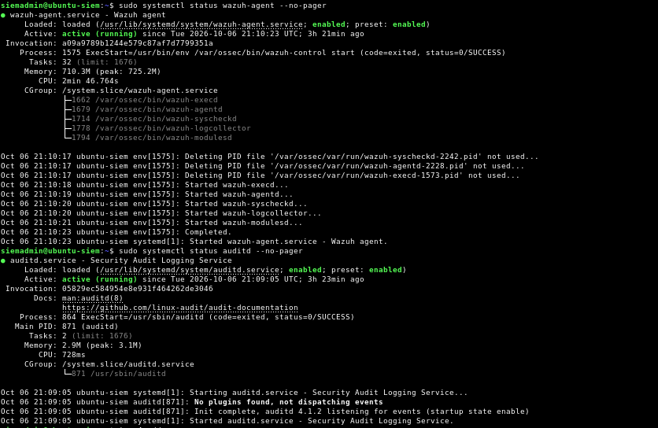

**Figure 1:** Verification that the Auditd service is active on the Ubuntu server.

During configuration, I encountered issues where Auditd did not restart correctly. I troubleshot the configuration and confirmed that the service returned to an active state.

---

## 2. Configure Auditd Monitoring

I configured Auditd to improve visibility into security-related activity occurring on the Ubuntu system.

I selected a frequency value of:

```bash
freq=3
```


After modifying the configuration, I verified that Auditd remained active before continuing with the attack simulation.
(View figure 2)

---

## 3. Verify Audit Rules

I checked the Auditd rules to confirm that the system was prepared to capture security-relevant activity.


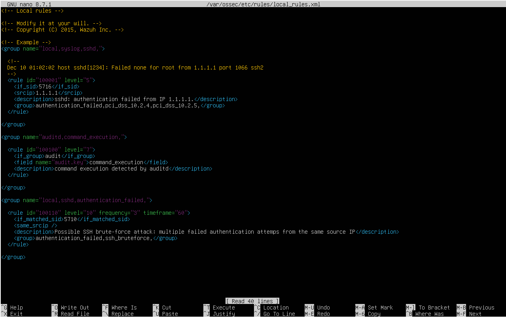

**Figure 2:** Verification of Auditd monitoring rules on the Ubuntu server.

This step is important because security events cannot be investigated if the monitoring system is not properly collecting them.

---

## 4. SSH Attack Simulation

After confirming that monitoring was operational, I began generating suspicious authentication activity against the Ubuntu SSH service.

The Ubuntu server was the target system, and SSH was accessible through:

```text
TCP Port 22
```

**View Figure 3:** SSH authentication testing against the Ubuntu server.

---

## 5. Password Guessing Simulation

I intentionally entered incorrect passwords multiple times to simulate password-guessing behavior.

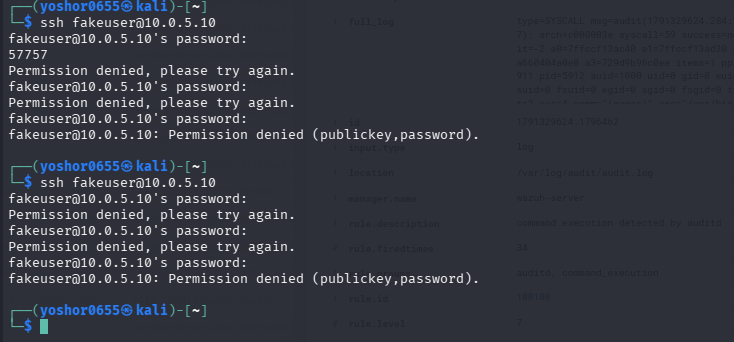

**Figure 3:** Multiple failed authentication attempts generated during the attack simulation.

A single failed login does not necessarily indicate malicious activity. A legitimate user could simply enter the wrong password.

However, repeated authentication failures within a short period can indicate password guessing or a potential brute-force attack.

---

## 6. Review Generated Security Events

After generating the authentication attempts, I reviewed the resulting security events to determine whether the activity was successfully captured.

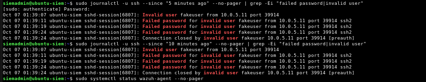
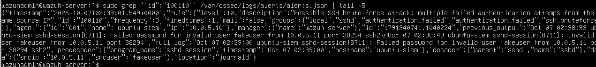

**Figure 4:** Authentication events generated by the simulated SSH activity.

The investigation focuses on identifying patterns such as:

- Repeated failed authentication attempts
- Source IP address
- Target account/user
- SSH port 22 activity
- Frequency of authentication attempts
- Successful authentication following multiple failures

---  

## 7. Investigating SSH Events in Wazuh SIEM

After generating multiple failed SSH authentication attempts and verifying the corresponding events in Ubuntu logs, I continued the investigation using Wazuh SIEM.

The objective was to determine whether the suspicious authentication activity was visible in Wazuh and identify relevant information for further investigation.

I accessed the Wazuh dashboard and used the Threat Hunting interface to investigate events associated with the monitored Ubuntu server.

During the investigation, I focused on:

- Identifying the source IP address
- Reviewing authentication failures
- Identifying the account involved
- Examining security event details
- Understanding how Wazuh presents and correlates security information

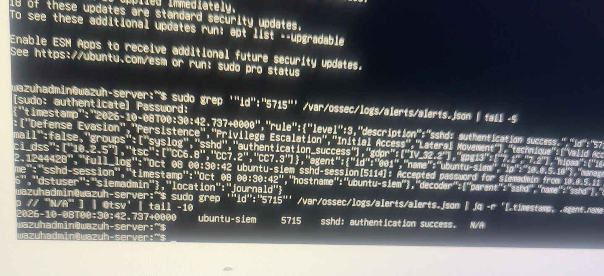

**Figure 5:** Investigation wazuh-generated authentication alerts through the server's alert logs.

### What I Learned

Wazuh provides centralized visibility into security activity. Instead of relying exclusively on terminal commands, a security analyst can use the SIEM interface to search, filter, and investigate events.

---

## 8. Identifying the Source IP and User Account

During the investigation, I examined the information associated with the suspicious authentication activity.

The following information was identified:

| Field | Finding |
|---|---|
| Source IP | 10.0.5.11 |
| User account | siemadmin |
| Monitored system | Ubuntu Server |
| Service | SSH |
| SIEM | Wazuh |

The source IP address helped identify the system associated with the investigated activity, while the username helped determine which account was involved.

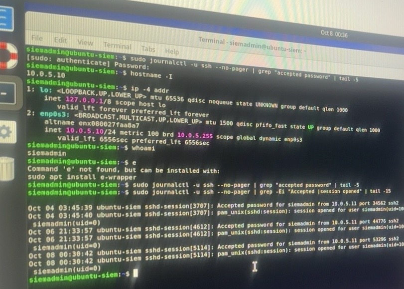
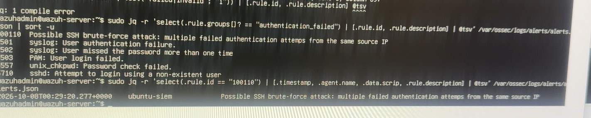

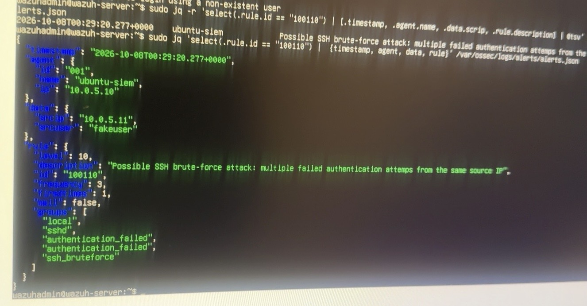
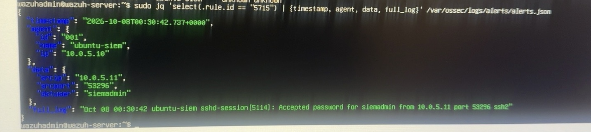

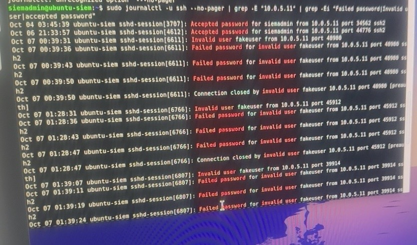

*Figure 6: Identifying the source IP address and user account during the investigation.*

### Successful SSH Authentication Analysis

During the investigation, I also identified successful SSH authentication events involving the `siemadmin` account.

Using Ubuntu authentication logs, I examined the source IP address, account name, and authentication outcome.

This helped me understand how an analyst can distinguish failed authentication attempts from successful access and investigate whether successful authentication is associated with earlier suspicious activity.

### Security Analysis

Identifying an IP address or username is not sufficient to determine whether activity is malicious.

Additional information, including authentication outcomes, timestamps, and subsequent user activity, is necessary to understand the event.


---

## 9. Investigating Privilege Escalation

As part of the investigation, I examined activity involving elevated privileges on the Ubuntu server.

The command involved was:

```bash
sudo -i
```

This command allows an authorized user to start a root login shell.

During the investigation, I confirmed that I personally executed this command as part of my lab testing.

The purpose of analyzing this event was to understand how privilege escalation activity could appear in security logs and why analysts must verify whether the activity was authorized.

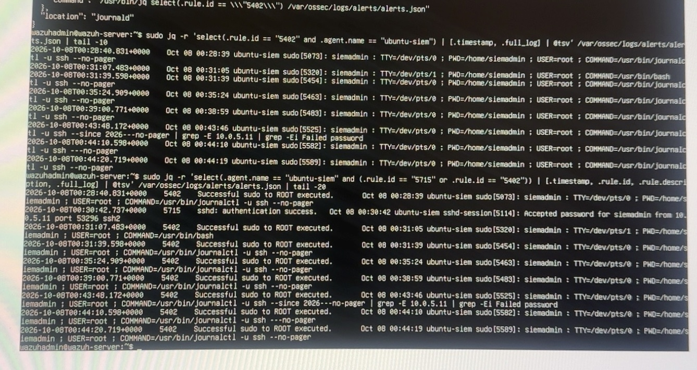
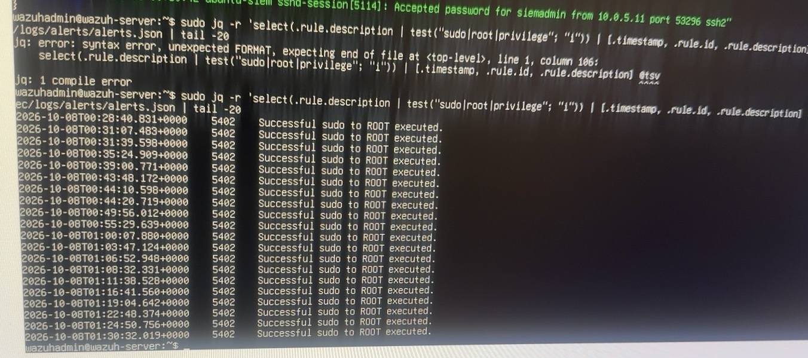
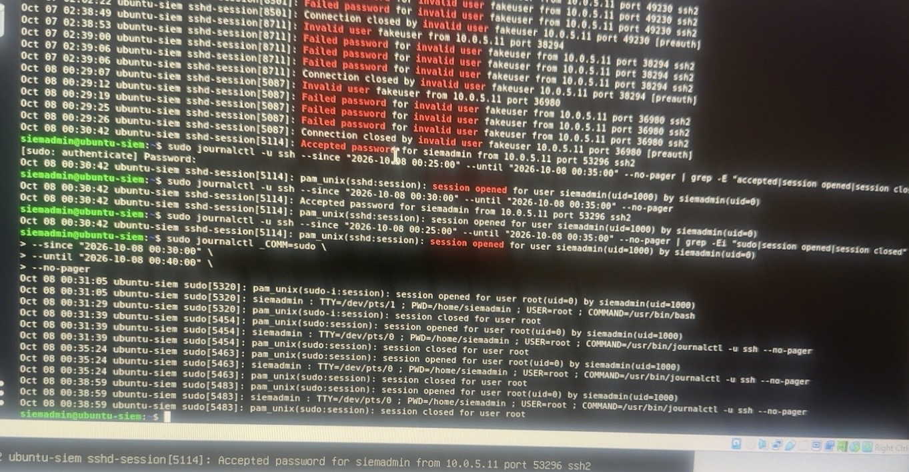
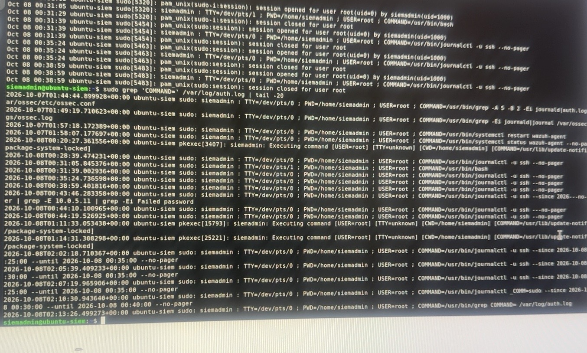


*Figure 7: Investigating privilege escalation activity on the Ubuntu server.*

### Security Analysis

Privilege escalation is an important activity to monitor because an attacker who obtains elevated permissions may gain greater control over a compromised system.

However, legitimate administrators also use elevated privileges to perform authorized tasks.

In this case, I knew that the `sudo -i` command was executed intentionally by me.

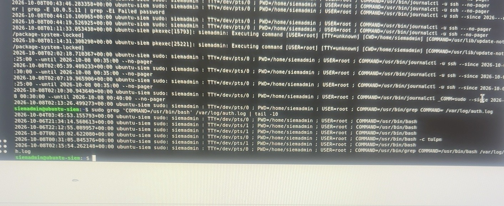

Therefore, the event was not evidence of unauthorized privilege escalation.

---

## 10. Correlating Authentication and Privilege Escalation Events

After investigating the authentication and privilege escalation activity, I considered how these events could be related during a security investigation.

The investigation included the following event categories:

1. Repeated failed SSH authentication attempts.
2. Identification of the source IP address.
3. Identification of the user account.
4. Review of authentication activity.
5. Investigation of privilege escalation.
6. Verification of whether the observed activity was authorized.

### Custom SSH Brute-Force Detection Rule

I examined a custom Wazuh detection rule designed to identify repeated SSH authentication failures. The rule uses event correlation to detect multiple failed login attempts within a defined time window.

During testing, I reviewed alerts associated with rule ID `100110`, which identified a potential SSH brute-force attack.

This helped me understand how SIEM detection rules transform individual authentication events into actionable security alerts.


### Detection and Investigation Workflow

```text
Repeated Failed SSH Attempts
              |
              v
     Review Ubuntu Logs
              |
              v
   Investigate Wazuh Events
              |
              v
     Identify Source IP
              |
              v
     Identify User Account
              |
              v
   Review Privilege Escalation
              |
              v
      Verify Authorization
              |
              v
       Analyst Conclusion
```

The basic detection concept for this activity is:

```text
Multiple failed SSH authentication attempts
                ↓
        Same source IP
                ↓
       Short time period
                ↓
    Repeated password guessing
                ↓
    Potential brute-force attack
```

This demonstrates an important detection-engineering concept:

> **Individual events provide information, but correlation between multiple events provides security context.**

---

### What I Learned

A security alert should be treated as a starting point for an investigation rather than immediate proof of compromise.

For example, repeated failed logins followed by successful authentication and privilege escalation could indicate an attacker gaining access to a system.

However, analysts must verify whether those events are actually connected and whether the actions were authorized.

This demonstrates the importance of event correlation, investigation, and contextual analysis in a Security Operations Center.

---


## 11. Investigation Findings – Before Containment

At this stage, I had completed the initial investigation of the simulated SSH activity.

### Key Findings

- Generated multiple failed SSH authentication attempts from Kali Linux.
- Verified authentication events in Ubuntu logs.
- Used Wazuh to investigate security-related activity.
- Identified source IP address `10.0.5.11` during the investigation.
- Identified the account `siemadmin`.
- Investigated privilege escalation involving `sudo -i`.
- Confirmed that the privilege escalation was performed intentionally during lab testing.
- Practiced distinguishing potentially suspicious activity from known authorized actions.

### Analyst Conclusion

The simulated SSH password-guessing activity demonstrated how repeated authentication failures can create indicators of a potential brute-force attack.

The investigation also demonstrated why analysts should not classify every privileged action as malicious.

Although the combination of authentication failures and privilege escalation may warrant investigation, the observed events must be evaluated using supporting evidence and knowledge of authorized activity.

**Containment has not yet been performed.**

The next stage will focus on containment techniques, validating their effectiveness, and documenting the outcome.


## Skills Practiced

During Phase 5 so far, I practiced:

- Linux security monitoring
- Auditd configuration
- Audit rule verification
- Linux service troubleshooting
- SSH authentication testing
- Password-guessing simulation
- Security log analysis
- Event correlation
- Brute-force attack identification
- Detection engineering fundamentals


## 12. Incident Containment – Blocking the Simulated Attacker

### Objective

After investigating the simulated SSH password-guessing activity, I moved to the containment stage of incident response.

The objective was to block SSH connections from the simulated attacker, verify that the firewall rule was effective, and collect evidence confirming that the unwanted traffic was being dropped.

I used Ubuntu's Uncomplicated Firewall (UFW), SSH connection testing, TCP packet capture, and firewall log analysis.

### 12.1 Identifying the Attacker's Source IP

Before verifying containment, I confirmed which source IP Kali Linux used to communicate with the Ubuntu server.

The route information showed:

```text
10.0.5.10 dev eth0 src 10.0.5.11 uid 1000
```

This confirmed:

- Source IP: `10.0.5.11` (Kali Linux)
- Destination IP: `10.0.5.10` (Ubuntu Server)
- Network interface: `eth0`

Verifying the source IP was important because the firewall rule needed to target the correct machine.

### 12.2 Configuring and Verifying UFW

I used UFW to restrict incoming SSH traffic from the simulated attacker.

I verified the firewall configuration using:

```bash
sudo ufw status verbose
```

The firewall reported:

```text
Status: active
Logging: on (low)
Default: deny (incoming)
```

The rules included:

```text
22/tcp       DENY IN    10.0.5.11
22/tcp       ALLOW IN   Anywhere
22/tcp (v6)  ALLOW IN   Anywhere (v6)
```

The specific deny rule was positioned before the general SSH allow rule.

This configuration allowed me to restrict SSH access from Kali while maintaining SSH access for other permitted sources.

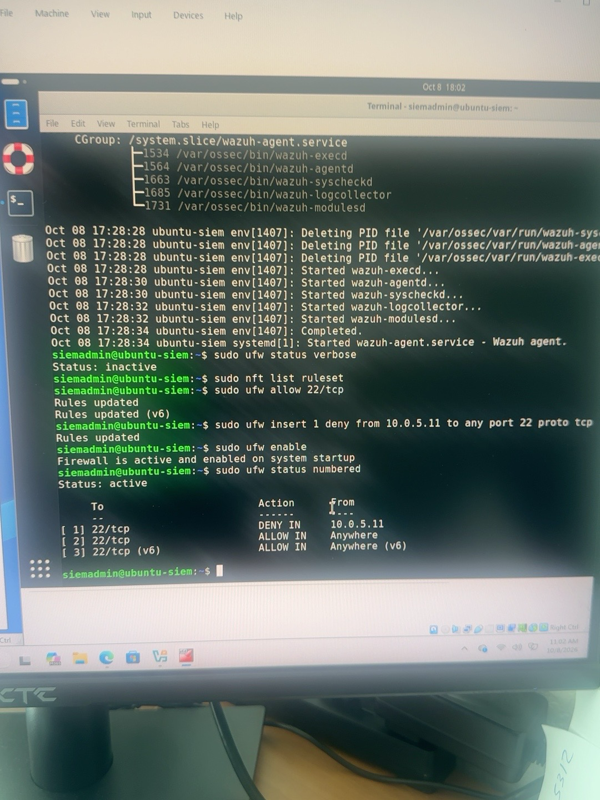

*Figure 8: UFW active with a rule denying SSH connections from Kali Linux.*

### 12.3 Testing SSH Connectivity After Containment

To determine whether the containment rule was effective, I attempted to establish an SSH connection from Kali to Ubuntu.

```bash
ssh -o ConnectTimeout=10 siemadmin@10.0.5.10
```

The connection timed out.

This indicated that Kali could no longer establish an SSH connection to the Ubuntu server.

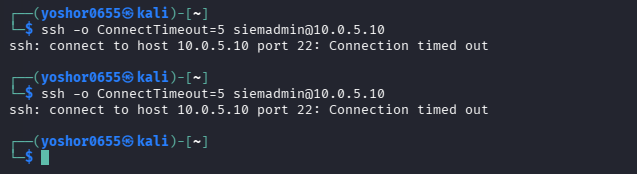

*Figure 9: SSH connection from Kali timing out after the firewall restriction was applied.*

### 12.4 Capturing Network Traffic Using tcpdump

To investigate whether the SSH packets were reaching Ubuntu, I used tcpdump to capture network traffic.

On Ubuntu, I executed:

```bash
sudo tcpdump -ni any 'src host 10.0.5.11 and dst host 10.0.5.10 and tcp dst port 22'
```

While tcpdump was running, I generated another SSH connection attempt from Kali.

```bash
ssh -o ConnectTimeout=10 siemadmin@10.0.5.10
```

The packet capture displayed traffic similar to:

```text
IP 10.0.5.11.31956 > 10.0.5.10.22: Flags [S]
```

The capture summary showed:

```text
5 packets captured
5 packets received by filter
0 packets dropped by kernel
```

The repeated TCP SYN packets demonstrated that Kali attempted to initiate an SSH connection and that Ubuntu received the connection attempts.

However, the SSH connection was not established.

 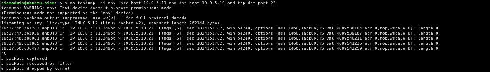

*Figure 10: tcpdump capturing repeated TCP SYN packets from Kali to Ubuntu SSH port 22.*

### Security Analysis

The packet capture confirmed that the SSH traffic reached Ubuntu.

The connection timeout demonstrated that the TCP connection was not successfully established.

Although this supported the containment findings, packet capture alone did not prove that UFW was responsible for dropping the traffic.

Additional firewall log evidence was required.

### 12.5 Investigating UFW Firewall Logs

After confirming that the SSH connection was unsuccessful, I investigated the Ubuntu firewall logs to identify explicit blocking events.

Initially, the following command returned no matching results:

```bash
sudo journalctl -k --since "30 minutes ago" --no-pager | grep 'UFW BLOCK' | grep 'SRC=10.0.5.11'
```

To improve event visibility, I increased the UFW logging level:

```bash
sudo ufw logging medium
```

I then generated another SSH connection attempt from Kali:

```bash
ssh -o ConnectTimeout=5 siemadmin@10.0.5.10
```

Afterward, I checked the firewall logs again:

```bash
sudo journalctl -k --since "5 minutes ago" --no-pager | grep 'UFW BLOCK'
```

I also used the UFW log file to review blocking events:

```bash
sudo grep 'UFW BLOCK' /var/log/ufw.log | tail -10
```

This investigation successfully revealed firewall entries confirming that UFW was blocking the simulated attacker's SSH packets.

**Screenshot 12 – UFW Block Logs**

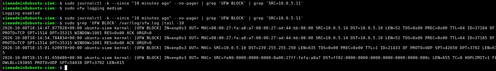

*Figure 11: Firewall log entries confirming blocked SSH traffic from Kali Linux.*

### 12.6 Analyzing the Firewall Events

The recorded firewall events contained the following information:

```text
[UFW BLOCK]
SRC=10.0.5.11
DST=10.0.5.10
PROTO=TCP
DPT=22
```

| Field | Explanation |
|---|---|
| UFW BLOCK | Firewall blocked the packet |
| SRC=10.0.5.11 | Kali Linux source address |
| DST=10.0.5.10 | Ubuntu destination address |
| PROTO=TCP | TCP network protocol |
| DPT=22 | SSH destination port |

These logs provided direct evidence that UFW was blocking incoming SSH traffic originating from the simulated attacker.

### 12.7 Containment Verification Results

The containment exercise produced the following results:

| Verification | Result |
|---|---|
| Kali source IP identified | Confirmed |
| UFW firewall active | Confirmed |
| SSH deny rule for Kali | Confirmed |
| SSH connection from Kali | Timed out |
| TCP SYN packets reached Ubuntu | Confirmed |
| UFW BLOCK events recorded | Confirmed |

### Analyst Conclusion

The containment exercise successfully demonstrated how to restrict suspicious SSH activity using a host-based firewall.

The active UFW deny rule, unsuccessful SSH connection attempts, TCP packet captures, and explicit firewall block logs provided consistent evidence that SSH traffic from Kali Linux was being blocked.

This exercise also demonstrated why multiple forms of evidence are important during incident response.

A firewall configuration alone does not prove that containment is effective. Connection testing and log verification provide stronger confirmation that the intended security control is working.

### Skills Practiced

- Incident containment
- UFW firewall configuration and verification
- Source IP validation
- SSH connectivity testing
- TCP packet capture using tcpdump
- TCP SYN packet analysis
- Linux firewall logging
- Firewall event investigation
- Security control validation
- Evidence-based incident response


