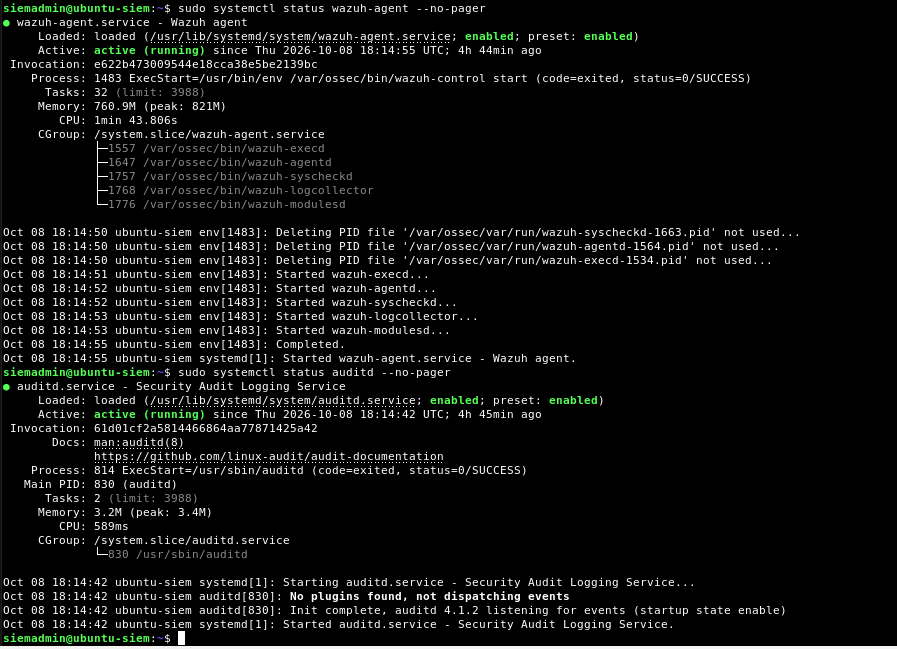
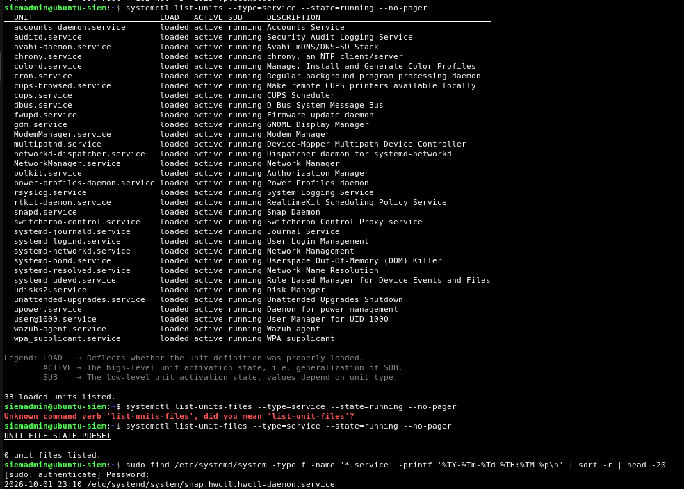
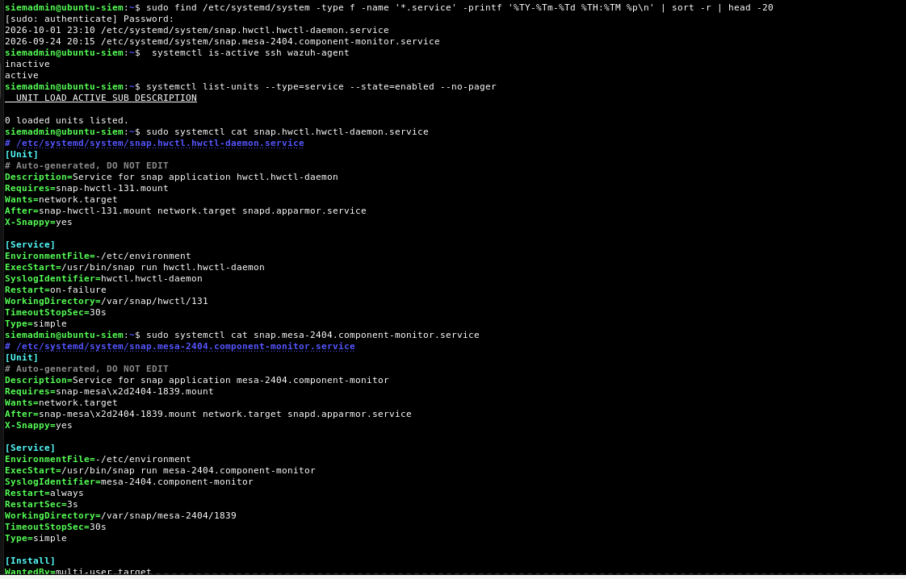

# Phase 5 – Detection Engineering and incident Response

## Objective

The goal of Phase 5 is to move beyond simply reviewing security logs and begin building a more structured detection process. In this phase, I generated suspicious activity, collected security events, configured monitoring, and prepared the environment for detection and investigation using Wazuh and Auditd.

---

## 1. Verify Auditd Service

I verified that the Auditd service was installed and running on the Ubuntu server before beginning the attack simulation.


**Figure 1:** Verification that the Auditd service is active on the Ubuntu server.

During configuration, I encountered issues where Auditd did not restart correctly. I troubleshot the configuration and confirmed that the service returned to an active state.

---

## 2. Configure Auditd Monitoring

I configured Auditd to improve visibility into security-related activity occurring on the Ubuntu system.

I selected a frequency value of:

```bash
freq=3
```


After modifying the configuration, I verified that Auditd remained active before continuing with the attack simulation.
(View figure 2)

---

## 3. Verify Audit Rules

I checked the Auditd rules to confirm that the system was prepared to capture security-relevant activity.


**Figure 2:** Verification of Auditd monitoring rules on the Ubuntu server.

This step is important because security events cannot be investigated if the monitoring system is not properly collecting them.

---

## 4. SSH Attack Simulation

After confirming that monitoring was operational, I began generating suspicious authentication activity against the Ubuntu SSH service.

The Ubuntu server was the target system, and SSH was accessible through:

```text
TCP Port 22
```

**View Figure 3:** SSH authentication testing against the Ubuntu server.

---

## 5. Password Guessing Simulation

I intentionally entered incorrect passwords multiple times to simulate password-guessing behavior.


**Figure 3:** Multiple failed authentication attempts generated during the attack simulation.

A single failed login does not necessarily indicate malicious activity. A legitimate user could simply enter the wrong password.

However, repeated authentication failures within a short period can indicate password guessing or a potential brute-force attack.

---

## 6. Review Generated Security Events

After generating the authentication attempts, I reviewed the resulting security events to determine whether the activity was successfully captured.


**Figure 4:** Authentication events generated by the simulated SSH activity.

The investigation focuses on identifying patterns such as:

- Repeated failed authentication attempts
- Source IP address
- Target account/user
- SSH port 22 activity
- Frequency of authentication attempts
- Successful authentication following multiple failures

---  

## 7. Investigating SSH Events in Wazuh SIEM

After generating multiple failed SSH authentication attempts and verifying the corresponding events in Ubuntu logs, I continued the investigation using Wazuh SIEM.

The objective was to determine whether the suspicious authentication activity was visible in Wazuh and identify relevant information for further investigation.

I accessed the Wazuh dashboard and used the Threat Hunting interface to investigate events associated with the monitored Ubuntu server.

During the investigation, I focused on:

- Identifying the source IP address
- Reviewing authentication failures
- Identifying the account involved
- Examining security event details
- Understanding how Wazuh presents and correlates security information


**Figure 5:** Investigation wazuh-generated authentication alerts through the server's alert logs.

### What I Learned

Wazuh provides centralized visibility into security activity. Instead of relying exclusively on terminal commands, a security analyst can use the SIEM interface to search, filter, and investigate events.

---

## 8. Identifying the Source IP and User Account

During the investigation, I examined the information associated with the suspicious authentication activity.

The following information was identified:

| Field | Finding |
|---|---|
| Source IP | 10.0.5.11 |
| User account | siemadmin |
| Monitored system | Ubuntu Server |
| Service | SSH |
| SIEM | Wazuh |

The source IP address helped identify the system associated with the investigated activity, while the username helped determine which account was involved.


*Figure 6: Identifying the source IP address and user account during the investigation.*

### Successful SSH Authentication Analysis

During the investigation, I also identified successful SSH authentication events involving the `siemadmin` account.

Using Ubuntu authentication logs, I examined the source IP address, account name, and authentication outcome.

This helped me understand how an analyst can distinguish failed authentication attempts from successful access and investigate whether successful authentication is associated with earlier suspicious activity.

### Security Analysis

Identifying an IP address or username is not sufficient to determine whether activity is malicious.

Additional information, including authentication outcomes, timestamps, and subsequent user activity, is necessary to understand the event.


---

## 9. Investigating Privilege Escalation

As part of the investigation, I examined activity involving elevated privileges on the Ubuntu server.

The command involved was:

```bash
sudo -i
```

This command allows an authorized user to start a root login shell.

During the investigation, I confirmed that I personally executed this command as part of my lab testing.

The purpose of analyzing this event was to understand how privilege escalation activity could appear in security logs and why analysts must verify whether the activity was authorized.


*Figure 7: Investigating privilege escalation activity on the Ubuntu server.*

### Security Analysis

Privilege escalation is an important activity to monitor because an attacker who obtains elevated permissions may gain greater control over a compromised system.

However, legitimate administrators also use elevated privileges to perform authorized tasks.

In this case, I knew that the `sudo -i` command was executed intentionally by me.


Therefore, the event was not evidence of unauthorized privilege escalation.

---

## 10. Correlating Authentication and Privilege Escalation Events

After investigating the authentication and privilege escalation activity, I considered how these events could be related during a security investigation.

The investigation included the following event categories:

1. Repeated failed SSH authentication attempts.
2. Identification of the source IP address.
3. Identification of the user account.
4. Review of authentication activity.
5. Investigation of privilege escalation.
6. Verification of whether the observed activity was authorized.

### Custom SSH Brute-Force Detection Rule

I examined a custom Wazuh detection rule designed to identify repeated SSH authentication failures. The rule uses event correlation to detect multiple failed login attempts within a defined time window.

During testing, I reviewed alerts associated with rule ID `100110`, which identified a potential SSH brute-force attack.

This helped me understand how SIEM detection rules transform individual authentication events into actionable security alerts.


### Detection and Investigation Workflow

```text
Repeated Failed SSH Attempts
              |
              v
     Review Ubuntu Logs
              |
              v
   Investigate Wazuh Events
              |
              v
     Identify Source IP
              |
              v
     Identify User Account
              |
              v
   Review Privilege Escalation
              |
              v
      Verify Authorization
              |
              v
       Analyst Conclusion
```

The basic detection concept for this activity is:

```text
Multiple failed SSH authentication attempts
                ↓
        Same source IP
                ↓
       Short time period
                ↓
    Repeated password guessing
                ↓
    Potential brute-force attack
```

This demonstrates an important detection-engineering concept:

> **Individual events provide information, but correlation between multiple events provides security context.**

---

### What I Learned

A security alert should be treated as a starting point for an investigation rather than immediate proof of compromise.

For example, repeated failed logins followed by successful authentication and privilege escalation could indicate an attacker gaining access to a system.

However, analysts must verify whether those events are actually connected and whether the actions were authorized.

This demonstrates the importance of event correlation, investigation, and contextual analysis in a Security Operations Center.

---


## 11. Investigation Findings – Before Containment

At this stage, I had completed the initial investigation of the simulated SSH activity.

### Key Findings

- Generated multiple failed SSH authentication attempts from Kali Linux.
- Verified authentication events in Ubuntu logs.
- Used Wazuh to investigate security-related activity.
- Identified source IP address `10.0.5.11` during the investigation.
- Identified the account `siemadmin`.
- Investigated privilege escalation involving `sudo -i`.
- Confirmed that the privilege escalation was performed intentionally during lab testing.
- Practiced distinguishing potentially suspicious activity from known authorized actions.

### Analyst Conclusion

The simulated SSH password-guessing activity demonstrated how repeated authentication failures can create indicators of a potential brute-force attack.

The investigation also demonstrated why analysts should not classify every privileged action as malicious.

Although the combination of authentication failures and privilege escalation may warrant investigation, the observed events must be evaluated using supporting evidence and knowledge of authorized activity.

**Containment has not yet been performed.**

The next stage will focus on containment techniques, validating their effectiveness, and documenting the outcome.


## Skills Practiced

During Phase 5 so far, I practiced:

- Linux security monitoring
- Auditd configuration
- Audit rule verification
- Linux service troubleshooting
- SSH authentication testing
- Password-guessing simulation
- Security log analysis
- Event correlation
- Brute-force attack identification
- Detection engineering fundamentals


## 12. Incident Containment – Blocking the Simulated Attacker

### Objective

After investigating the simulated SSH password-guessing activity, I moved to the containment stage of incident response.

The objective was to block SSH connections from the simulated attacker, verify that the firewall rule was effective, and collect evidence confirming that the unwanted traffic was being dropped.

I used Ubuntu's Uncomplicated Firewall (UFW), SSH connection testing, TCP packet capture, and firewall log analysis.

### 12.1 Identifying the Attacker's Source IP

Before verifying containment, I confirmed which source IP Kali Linux used to communicate with the Ubuntu server.

The route information showed:

```text
10.0.5.10 dev eth0 src 10.0.5.11 uid 1000
```

This confirmed:

- Source IP: `10.0.5.11` (Kali Linux)
- Destination IP: `10.0.5.10` (Ubuntu Server)
- Network interface: `eth0`

Verifying the source IP was important because the firewall rule needed to target the correct machine.

### 12.2 Configuring and Verifying UFW

I used UFW to restrict incoming SSH traffic from the simulated attacker.

I verified the firewall configuration using:

```bash
sudo ufw status verbose
```

The firewall reported:

```text
Status: active
Logging: on (low)
Default: deny (incoming)
```

The rules included:

```text
22/tcp       DENY IN    10.0.5.11
22/tcp       ALLOW IN   Anywhere
22/tcp (v6)  ALLOW IN   Anywhere (v6)
```

The specific deny rule was positioned before the general SSH allow rule.

This configuration allowed me to restrict SSH access from Kali while maintaining SSH access for other permitted sources.


*Figure 8: UFW active with a rule denying SSH connections from Kali Linux.*

### 12.3 Testing SSH Connectivity After Containment

To determine whether the containment rule was effective, I attempted to establish an SSH connection from Kali to Ubuntu.

```bash
ssh -o ConnectTimeout=10 siemadmin@10.0.5.10
```

The connection timed out.

This indicated that Kali could no longer establish an SSH connection to the Ubuntu server.


*Figure 9: SSH connection from Kali timing out after the firewall restriction was applied.*

### 12.4 Capturing Network Traffic Using tcpdump

To investigate whether the SSH packets were reaching Ubuntu, I used tcpdump to capture network traffic.

On Ubuntu, I executed:

```bash
sudo tcpdump -ni any 'src host 10.0.5.11 and dst host 10.0.5.10 and tcp dst port 22'
```

While tcpdump was running, I generated another SSH connection attempt from Kali.

```bash
ssh -o ConnectTimeout=10 siemadmin@10.0.5.10
```

The packet capture displayed traffic similar to:

```text
IP 10.0.5.11.31956 > 10.0.5.10.22: Flags [S]
```

The capture summary showed:

```text
5 packets captured
5 packets received by filter
0 packets dropped by kernel
```

The repeated TCP SYN packets demonstrated that Kali attempted to initiate an SSH connection and that Ubuntu received the connection attempts.

However, the SSH connection was not established.

 

*Figure 10: tcpdump capturing repeated TCP SYN packets from Kali to Ubuntu SSH port 22.*

### Security Analysis

The packet capture confirmed that the SSH traffic reached Ubuntu.

The connection timeout demonstrated that the TCP connection was not successfully established.

Although this supported the containment findings, packet capture alone did not prove that UFW was responsible for dropping the traffic.

Additional firewall log evidence was required.

### 12.5 Investigating UFW Firewall Logs

After confirming that the SSH connection was unsuccessful, I investigated the Ubuntu firewall logs to identify explicit blocking events.

Initially, the following command returned no matching results:

```bash
sudo journalctl -k --since "30 minutes ago" --no-pager | grep 'UFW BLOCK' | grep 'SRC=10.0.5.11'
```

To improve event visibility, I increased the UFW logging level:

```bash
sudo ufw logging medium
```

I then generated another SSH connection attempt from Kali:

```bash
ssh -o ConnectTimeout=5 siemadmin@10.0.5.10
```

Afterward, I checked the firewall logs again:

```bash
sudo journalctl -k --since "5 minutes ago" --no-pager | grep 'UFW BLOCK'
```

I also used the UFW log file to review blocking events:

```bash
sudo grep 'UFW BLOCK' /var/log/ufw.log | tail -10
```

This investigation successfully revealed firewall entries confirming that UFW was blocking the simulated attacker's SSH packets.

**Screenshot 12 – UFW Block Logs**


*Figure 11: Firewall log entries confirming blocked SSH traffic from Kali Linux.*

### 12.6 Analyzing the Firewall Events

The recorded firewall events contained the following information:

```text
[UFW BLOCK]
SRC=10.0.5.11
DST=10.0.5.10
PROTO=TCP
DPT=22
```

| Field | Explanation |
|---|---|
| UFW BLOCK | Firewall blocked the packet |
| SRC=10.0.5.11 | Kali Linux source address |
| DST=10.0.5.10 | Ubuntu destination address |
| PROTO=TCP | TCP network protocol |
| DPT=22 | SSH destination port |

These logs provided direct evidence that UFW was blocking incoming SSH traffic originating from the simulated attacker.

### 12.7 Containment Verification Results

The containment exercise produced the following results:

| Verification | Result |
|---|---|
| Kali source IP identified | Confirmed |
| UFW firewall active | Confirmed |
| SSH deny rule for Kali | Confirmed |
| SSH connection from Kali | Timed out |
| TCP SYN packets reached Ubuntu | Confirmed |
| UFW BLOCK events recorded | Confirmed |

### Analyst Conclusion

The containment exercise successfully demonstrated how to restrict suspicious SSH activity using a host-based firewall.

The active UFW deny rule, unsuccessful SSH connection attempts, TCP packet captures, and explicit firewall block logs provided consistent evidence that SSH traffic from Kali Linux was being blocked.

This exercise also demonstrated why multiple forms of evidence are important during incident response.

A firewall configuration alone does not prove that containment is effective. Connection testing and log verification provide stronger confirmation that the intended security control is working.

### Skills Practiced

- Incident containment
- UFW firewall configuration and verification
- Source IP validation
- SSH connectivity testing
- TCP packet capture using tcpdump
- TCP SYN packet analysis
- Linux firewall logging
- Firewall event investigation
- Security control validation
- Evidence-based incident response

### 12.7 Verifying Firewall Containment Using Packet Counters

After configuring UFW to block SSH connections from the simulated attacker, I performed additional verification to confirm that the firewall was actually dropping traffic.

Initially, I reviewed UFW block logs, but some entries showed traffic originating from `10.0.5.14` rather than the Kali Linux IP address `10.0.5.11`.

This distinction was important because firewall logs showing blocked traffic from another source do not prove that the intended attacker was contained.

I therefore investigated the firewall rule directly using packet counters.

**Command executed on Ubuntu:**

```bash
sudo iptables -L ufw-user-input -n -v --line-numbers
```

The initial output showed a DROP rule configured for SSH traffic from `10.0.5.11`, followed by a general ACCEPT rule for SSH traffic.

However, the DROP rule initially showed zero matching packets.

To test the firewall, I generated another SSH connection attempt from Kali:

```bash
ssh -o ConnectTimeout=5 siemadmin@10.0.5.10
```

I then checked the firewall packet counters again.

**Verified results:**

| Field | Result |
|---|---|
| Firewall action | DROP |
| Source IP | 10.0.5.11 |
| Destination port | TCP 22 (SSH) |
| Initial packet counter | 0 |
| Final packet counter | 55 |
| Final byte counter | 3,300 |

The DROP rule counter increased from zero to **55 packets and 3,300 bytes**.

This provided direct evidence that traffic from the simulated attacker matched the firewall's blocking rule.

![Insert screenshot showing the DROP rule with 55 packets and 3,300 bytes]](f-a.png)

*Figure: Firewall packet counters confirming that SSH traffic from Kali Linux matched the DROP rule.*

**Security Analysis:**

This exercise demonstrated the difference between configuring a security control and verifying that the control actually works.

The increased packet counter confirmed that the firewall was processing matching traffic from Kali and applying the DROP action.

---

### 12.8 Verifying SSH Authentication Logs After Containment

After confirming the firewall was dropping Kali's traffic, I investigated whether new SSH authentication events appeared on Ubuntu.

**Command executed:**

```bash
sudo journalctl -u ssh --since "5 minutes ago" --no-pager
```

**Result:**

```text
-- No entries --
```

No SSH journal entries were returned for the five-minute period examined.

**Security Analysis:**

The absence of SSH authentication events was consistent with the firewall blocking connection attempts before SSH authentication could occur.

However, an empty journal result alone does not prove that no traffic reached the SSH service. It must be interpreted alongside the firewall counters, packet capture, and connection test.

The combined evidence supported the conclusion that Kali's new SSH connection attempts were successfully blocked.

---

### 12.9 Verifying Security Monitoring After Containment

After implementing and verifying network containment, I checked whether the security monitoring services remained operational.

The objective was to ensure that blocking the simulated attacker had not interrupted endpoint monitoring or system audit logging.

**Command 1 – Verify Wazuh Agent**

```bash
sudo systemctl status wazuh-agent --no-pager
```

**Result:** Active (running)

**Command 2 – Verify Auditd**

```bash
sudo systemctl status auditd --no-pager
```

**Result:** Active (running)

Both services remained operational after containment.

| Security component | Verified status |
|---|---|
| UFW firewall | Active |
| Kali SSH blocking rule | DROP |
| Firewall packet counter | 55 packets |
| Firewall byte counter | 3,300 bytes |
| Recent SSH journal | No entries in checked period |
| Wazuh agent | Active (running) |
| Auditd | Active (running) |



*Figure: Confirming that security monitoring and audit logging remained operational following containment.*

---

### 12.10 Final Containment Verification and Analyst Conclusion

The containment investigation produced multiple forms of evidence demonstrating that SSH traffic from the simulated attacker was successfully blocked.

**Evidence collected:**

1. A UFW DROP rule targeting Kali Linux (`10.0.5.11`) on TCP port 22.
2. SSH connection attempts from Kali resulting in connection timeouts.
3. Firewall packet counters increasing from zero to 55 matching packets.
4. A total of 3,300 bytes recorded by the DROP rule.
5. No new SSH journal entries during the checked five-minute period.
6. Wazuh and Auditd remaining active after containment.

The investigation also reinforced the importance of validating the source IP address when interpreting firewall logs. Earlier blocked traffic from `10.0.5.14` could not be used as evidence of containment for Kali (`10.0.5.11`).

**Final Analyst Conclusion:**

The simulated attacker's new SSH connection attempts were successfully contained through UFW firewall controls.

The firewall packet counters provided direct evidence that Kali's traffic matched the DROP rule, while the SSH journal investigation and monitoring-service checks provided additional supporting evidence.

This exercise strengthened my practical understanding of:

- Network containment and firewall rule verification.
- Interpreting firewall packet counters.
- Correlating network controls with authentication logs.
- Validating source and destination IP addresses.
- Maintaining security visibility after containment.

**Containment status: Verified successful.**

Further investigation of active sessions and persistence mechanisms is documented in Sections 13–15.


## 13. Investigating Active SSH Sessions

After blocking new SSH connections from Kali, I investigated whether any existing SSH sessions remained active.

This step was important because blocking new connections does not necessarily terminate previously established sessions.

### Commands Executed

```bash
who
w
sudo ss -tnp | grep ':22'
```

### Investigation Findings

The `w` command identified my legitimate local session:

```text
siemadmin  tty2
```

The SSH connection check returned no output, indicating that no TCP connections involving port 22 were displayed at the time of inspection.

An additional service check confirmed that SSH was still listening on port 22.

### Analyst Conclusion

No active SSH connections were identified during the investigation.

The SSH service remained available for permitted connections, while the UFW firewall continued blocking SSH attempts from Kali.

This demonstrated the difference between blocking new connections and verifying whether existing sessions remain active.

---

## 14. Investigating Persistence Mechanisms

Following containment and active-session verification, I began investigating whether the simulated attack had left behind any unauthorized access mechanisms.

The investigation focused on SSH keys, user accounts, administrative privileges, and scheduled tasks.

### 14.1 SSH Authorized Keys Investigation

I inspected the SSH configuration directory for the `siemadmin` account.

```bash
sudo ls -la /home/siemadmin/.ssh/
sudo cat /home/siemadmin/.ssh/authorized_keys
```

The directory contained a `known_hosts` file, but no `authorized_keys` file was identified.

**Finding:** No evidence of unauthorized SSH keys was discovered in the inspected account directory.

### 14.2 User Account and Administrative Privilege Investigation

I checked regular user accounts:

```bash
awk -F: '$3 >= 1000 && $3 < 65534 {print $1, $3, $6, $7}' /etc/passwd
```

The result identified:

```text
siemadmin 1000 /home/siemadmin /bin/bash
```

I also reviewed sudo group membership:

```bash
getent group sudo
```

The result showed:

```text
sudo:x:27:siemadmin
```

**Finding:** No unexpected regular-user accounts or sudo-group members were identified in these checks.

### 14.3 Scheduled Task Investigation

I examined scheduled tasks that could potentially be used to maintain unauthorized access.

Commands executed:

```bash
sudo crontab -l
crontab -l
sudo ls -la /etc/cron.d /etc/cron.daily /etc/cron.hourly
```

Both the root and `siemadmin` accounts had no personal crontab entries.

The inspected system cron directories contained recognizable Ubuntu maintenance components, including `anacron`, `apt-compat`, `dpkg`, `logrotate`, and `man-db`.

**Finding:** No obvious malicious scheduled tasks were identified in the inspected locations.

### Investigation Conclusion

The persistence investigation found no evidence of unauthorized SSH keys, unexpected regular-user accounts, unexpected sudo-group membership, or obviously malicious cron jobs in the locations examined.

However, these checks do not eliminate the possibility of persistence through other mechanisms.

Additional investigation of systemd services and other startup mechanisms is necessary before reaching a broader conclusion.

---
## 15. Investigating Systemd Services for Persistence

### Objective

After investigating SSH authorized keys, user accounts, administrative privileges, and scheduled tasks, I continued examining potential persistence mechanisms on the Ubuntu server.

The objective was to identify suspicious systemd services that could allow an attacker to maintain access or automatically execute malicious programs after a system restart.

### 15.1 Identifying Running Services

I executed the following command to list currently running services:

```bash
systemctl list-units --type=service --state=running --no-pager
```

The results included several legitimate system services:

- `auditd.service` – Records security audit events.
- `cron.service` – Manages scheduled tasks.
- `systemd-journald.service` – Collects system logs.
- `wazuh-agent.service` – Collects security telemetry for Wazuh.

The Wazuh agent was confirmed active and running.

Although SSH had previously been used during the attack simulation, `ssh.service` was not visible in the displayed running-service list. Therefore, its status required separate verification.



*Figure 16: Reviewing running systemd services on Ubuntu to identify potentially suspicious processes.*

### 15.2 Investigating Enabled Services

I examined services configured to start automatically:

```bash
systemctl list-unit-files --type=service --state=enabled --no-pager
```

This helped identify services configured for automatic startup, which can be important when investigating persistence.

No obviously unfamiliar services were identified during the initial review.

**See Figure 17 – Enabled Systemd Services for potential persistence mechanisms.**

### 15.3 Investigating Recently Modified Service Files

I also inspected service files under `/etc/systemd/system`:

```bash
sudo find /etc/systemd/system -type f -name '*.service' -printf '%TY-%Tm-%Td %TH:%TM %p\n' | sort -r | head -20
```

The search identified two service files associated with Snap components.

Neither appeared obviously malicious based on its filename.

However, identifying a familiar service name does not automatically confirm that the service is safe.

Additional verification may include reviewing the service configuration, executable path, and associated processes.



*Figure 17: Inspecting service files to identify potentially suspicious persistence mechanisms.*

### 15.4 Security Analysis

An attacker who obtains root privileges may create or modify a systemd service to execute malicious commands automatically.

For example, a malicious service could be configured to restart after a system reboot, allowing an attacker to maintain access.

This technique is known as **persistence**.

During my investigation, I reviewed running services, enabled services, and service files to identify potentially unauthorized activity.

### Investigation Findings

| Investigation | Result |
|---|---|
| Wazuh agent | Active and running |
| Auditd service | Observed running |
| Cron service | Observed running |
| Systemd journal | Observed running |
| SSH service | Requires separate status verification |
| Unfamiliar running services | None identified |
| Suspicious enabled services | None obvious |
| Service files reviewed | Two Snap-related service files |
| Confirmed malicious persistence | None identified |

### Analyst Conclusion

The initial systemd investigation did not reveal any obviously malicious services or unauthorized persistence mechanisms.

However, the absence of suspicious services in the reviewed output does not completely rule out persistence.

This exercise helped me understand how attackers may abuse systemd services to maintain access and why service configuration, startup behavior, and executable paths are important during incident response.

**Status: Initial systemd persistence investigation completed.**


---

## 16. Phase 5 – Final Conclusion and Lessons Learned

### Project Overview

In Phase 5 of my cybersecurity home lab, I expanded my practical experience in security detection, threat investigation, and incident response using Kali Linux, Ubuntu, Wazuh SIEM, Auditd, and UFW.

The objective was to simulate suspicious SSH authentication activity, investigate the resulting security events, correlate evidence from multiple sources, and implement containment measures against the simulated attacker.

### Key Accomplishments

**1. Attack Simulation and Detection**

- Generated repeated SSH authentication attempts from Kali Linux (`10.0.5.11`) against Ubuntu (`10.0.5.10`).
- Investigated failed and successful authentication events using Linux system logs.
- Used Wazuh SIEM and custom detection logic to analyze suspicious authentication activity.
- Examined privilege escalation activity involving `sudo -i` and correlated relevant security events.

**2. Security Investigation and Event Correlation**

- Identified source IP addresses, user accounts, authentication outcomes, and relevant event timestamps.
- Investigated SSH authentication logs and system activity.
- Practiced distinguishing potentially suspicious behavior from authorized lab activity.
- Learned the importance of correlating multiple events before determining whether an incident represents unauthorized access.

**3. Incident Containment**

- Configured UFW to block SSH traffic from the simulated attacker.
- Verified the containment rule through SSH connection tests, packet captures, and firewall inspection.
- Confirmed that the firewall DROP rule matched **55 packets totaling 3,300 bytes**.
- Reviewed UFW and SSH logs to support the containment findings.

**4. Post-Containment Verification**

- Checked logged-in users and active SSH connections.
- Confirmed that no established SSH connections were displayed during verification.
- Verified that Wazuh Agent and Auditd remained active after containment.

**5. Persistence Investigation**

- Inspected SSH authorized keys for potential unauthorized access.
- Reviewed user accounts and sudo-group membership.
- Investigated root, user, and system cron jobs.
- Examined running and enabled systemd services and relevant service files.
- Found no obvious evidence of unauthorized persistence in the locations inspected.

### Tools and Technologies Used

| Tool | Purpose |
|---|---|
| Kali Linux | Simulated attacker |
| Ubuntu Linux | Target server and monitored endpoint |
| Wazuh SIEM | Security event monitoring and detection |
| Auditd | System auditing and command execution visibility |
| SSH | Remote authentication testing |
| UFW / iptables | Network containment and firewall verification |
| tcpdump | Network packet capture |
| journalctl | Authentication and system log investigation |
| systemctl | Service monitoring and persistence investigation |

### Key Lessons Learned

This phase reinforced several important cybersecurity principles:

1. **Detection requires context.** Multiple related security events can indicate suspicious activity, but successful authentication or privilege escalation does not automatically prove malicious intent.

2. **Containment must be verified.** Configuring a firewall rule is not sufficient. Packet counters, connection tests, and logs provide stronger evidence that the security control is functioning.

3. **Source IP validation matters.** Firewall events must be associated with the correct source address before they can support an investigation.

4. **Blocking access does not guarantee eradication.** Security analysts must investigate existing sessions, unauthorized accounts, scheduled tasks, and other persistence mechanisms.

5. **Security monitoring should remain operational.** Wazuh and Auditd were verified as active following containment.

6. **Evidence-based reporting is essential.** Investigation findings should distinguish confirmed observations from assumptions and areas requiring further verification.

### Final Assessment

The simulated attacker's new SSH connection attempts were successfully contained using UFW, with supporting evidence from firewall packet counters, connection tests, and system logs.

Post-containment checks did not identify active SSH connections or obvious unauthorized persistence mechanisms in the inspected locations.

However, these findings do not constitute a comprehensive forensic examination or prove that every possible persistence mechanism has been eliminated.

The privilege escalation activity observed during this exercise was intentionally performed as part of the authorized lab simulation.

### Phase 5 Status

**Completed – Detection, Investigation, Containment, and Initial Persistence Verification**

Phase 5 provided practical experience with several responsibilities commonly performed by Security Operations Center (SOC) analysts, including threat detection, log analysis, incident investigation, containment validation, and security documentation.

This phase strengthened my ability to investigate security events systematically and support conclusions with technical evidence.

**Next Phase: Phase 6 – Advanced Security Monitoring and Incident Response**

The next phase will build on these skills through more advanced detection, alert investigation, and incident response exercises.


